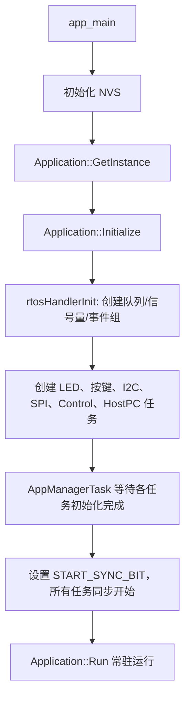
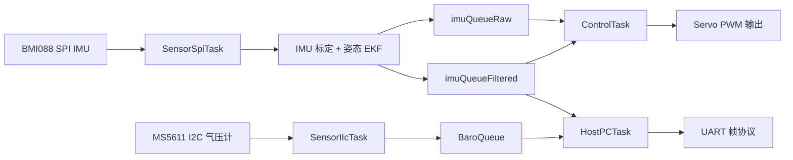

# PinyDart

PinyDart 是一个基于 ESP32-S3 和 ESP-IDF 的嵌入式控制项目，核心目标是完成飞镖/弹体类平台的姿态采集、姿态解算、上位机通信和舵机控制。项目已经把硬件驱动、传感器采样、姿态估计算法、控制输出和通信协议拆成了相对清晰的模块，适合作为一个实时嵌入式姿态控制系统继续迭代。

## 项目构成

```text
PinyDart/
├── CMakeLists.txt                 # ESP-IDF 工程入口，设置 C++20 与工程名
├── sdkconfig                      # 当前目标配置，目标芯片为 esp32s3
├── main/
│   ├── main.cpp                   # app_main 入口，初始化 NVS 并启动 Application
│   ├── CMakeLists.txt             # 按模块注册 main 组件源文件
│   ├── idf_component.yml          # ESP-IDF 组件依赖
│   ├── App/                       # 应用层任务、控制逻辑、上位机通信
│   ├── Sensors/                   # 总线驱动、传感器驱动与传感器数据结构
│   ├── Device/                    # 舵机、蜂鸣器、WS2812、TF 卡等外设封装
│   ├── Protocol/                  # Wi-Fi UDP 客户端
│   ├── Algorithm/                 # 姿态解算、滤波、标定与数学工具
│   └── mLog/                      # 串口日志输出辅助
├── test_*.py                      # 上位机测试与 IMU 标定脚本
├── doc/                           # 简单项目记录
└── temple/                        # 传输协议/通信抽象的实验性代码，当前未编入 main 组件
```

## 技术栈

| 分类 | 使用内容 |
| --- | --- |
| 主控平台 | ESP32-S3，Xtensa 架构 |
| 开发框架 | ESP-IDF，CMake，IDF Component Manager |
| 主要语言 | C++20，少量 C 与 Python 工具脚本 |
| 实时系统 | FreeRTOS task、queue、semaphore、event group、pinned task |
| 硬件接口 | GPIO、SPI、I2C、UART、LEDC PWM、RMT、SDMMC |
| 网络通信 | ESP Wi-Fi STA、lwIP socket、UDP |
| 文件系统 | FATFS + SDMMC TF 卡挂载 |
| 传感器 | BMI088 六轴 IMU、MS5611 气压计，ADXL375 高 g 加速度计预留 |
| 执行/反馈外设 | 舵机、WS2812 RGB LED、蜂鸣器、按键 |
| 算法 | 四元数/欧拉角转换、姿态 EKF、IMU 标定、低通滤波、一维卡尔曼高度滤波 |
| 上位机工具 | pyserial、numpy、matplotlib、scipy、UDP socket 测试 |

`main/idf_component.yml` 当前声明了这些外部组件依赖：

- `espressif/led_strip`：驱动 WS2812 LED。
- `hayschan/buzzer`：蜂鸣器相关组件依赖。
- `espressif/servo`：舵机组件依赖。
- `espp/math`：数学工具，例如快速平方根倒数。

## 快速开始

在 ESP-IDF 环境中进入项目根目录后：

```bash
idf.py set-target esp32s3
idf.py build
idf.py -p COMx flash monitor
```

如果需要测试 UDP 输出，可以在上位机运行：

```bash
python test_udp_socket.py
```

如果需要重新做 IMU 加速度计标定，可以参考：

```bash
python test_automatic_calibrate.py
python test_auto_serial_calibrate.py
```

标定脚本会采集串口数据并拟合校准矩阵，最终输出可复制回 `main/Algorithm/Calibrate/calibrate.hpp` 的 `ACC_CALI` 常量。

## 硬件连接参考

这些引脚来自当前代码配置，修改硬件时优先检查对应源文件。

| 功能 | 引脚/配置 | 代码位置 |
| --- | --- | --- |
| 状态 GPIO LED | GPIO38 | `main/App/application.cpp` |
| WS2812 | GPIO39，2 颗 LED | `main/Device/WS2812/ws2812.hpp` |
| 按键 | GPIO35 | `main/App/application.cpp` |
| I2C 气压计 | I2C1，SCL GPIO10，SDA GPIO11，MS5611 地址 `0x77` | `SensorIIcTask` |
| SPI IMU | SPI2，SCLK GPIO33，MOSI GPIO34，MISO GPIO48 | `SensorSpiTask` |
| BMI088 加速度计 CS | GPIO47 | `SensorSpiTask` |
| BMI088 陀螺仪 CS | GPIO37 | `SensorSpiTask` |
| ADXL375 预留 CS | GPIO40 | `SensorSpiTask` 注释代码 |
| 舵机输出 | GPIO13、14、3、16、15、17、18 | `main/Device/Servo/servo.hpp` |
| 蜂鸣器 | GPIO21，RMT 输出 | `Application` 构造函数 |
| 上位机 UART1 | TX GPIO41，RX GPIO46，1.5 Mbps | `main/App/include/hostpc.hpp` |
| TF 卡 | CLK GPIO5，CMD GPIO6，D0 GPIO4 | `main/Device/TFCard/tfcard.hpp` |

## 程序启动流程



### 任务与数据流



## 主要代码介绍

### 入口与应用层

- `main/main.cpp` 是 ESP-IDF 标准入口，负责初始化 NVS。遇到 NVS 页满或版本变化时会先擦除再重新初始化，然后进入 `Application`。
- `main/App/application.cpp` 是项目调度中心。它创建 LED、按键、I2C 传感器、SPI 传感器、控制、上位机通信和应用管理任务。
- `main/App/basicInclude.*` 定义全局 `rtoshandler`，集中保存 IMU、气压计、控制命令队列，以及任务启动同步用的信号量和事件组。
- `Tools::AppManagerTask` 会等待每个任务报告初始化完成，再统一释放 `START_SYNC_BIT`，避免某些任务先跑起来时队列或外设还没准备好。

### 传感器采集

- `SensorSpiTask` 初始化 SPI2 和 BMI088，周期约 10 ms 读取加速度计/陀螺仪数据。
- 读取到的 IMU 数据先经过 `IMUCalibration` 做加速度计校正，再进入 `AttitudeEKF` 做姿态估计。
- 姿态结果以四元数和欧拉角形式写入 `imuQueueFiltered`，原始/换算后的 IMU 数据写入 `imuQueueRaw`。
- `SensorIIcTask` 初始化 I2C1 和 MS5611，读取温度、气压和相对高度，并通过 `BaroQueue` 发送给其他任务。

### 姿态与滤波算法

- `main/Algorithm/AuxiliaryMath.*` 提供 `Vec3`、`Quat`、矩阵结构，以及四元数归一化、欧拉角转换等基础数学工具。
- `main/Algorithm/kalman6asix.*` 实现姿态 EKF，状态包含四元数和陀螺仪 bias。算法中包含预测、加速度观测更新、静止检测、自适应观测噪声和协方差更新。
- `main/Algorithm/Calibrate/calibrate.*` 封装 IMU 标定参数和修正逻辑，支持加速度计 3x3 校准矩阵、零偏修正和陀螺仪 bias 修正。
- `main/Algorithm/lpf.hpp` 和一维 Kalman 相关文件用于控制环微分项平滑和高度数据滤波。

### 控制输出

- `main/App/control.cpp` 中的 `ControlTask` 以约 100 Hz 周期运行，读取姿态、原始 IMU 和上位机控制命令。
- `Control::update()` 根据目标角速度或阻尼策略计算 yaw/pitch/roll 控制量，并通过低通滤波处理误差微分项。
- 输出经过死区、限幅和混控映射后写入 `Servo::SetDelta()`，最终转换为舵机角度。
- 当前混控代码中 pitch 是主要输出项，yaw/roll 混入项已经留好变量和结构，但在 `s1` 到 `s4` 的实际表达式中仍处于注释/预留状态。

### 上位机通信

- `main/App/hostpc.cpp` 通过 UART1 与上位机通信，波特率配置为 1.5 Mbps。
- 发送帧格式为 `SOF | TYPE | LEN | PAYLOAD | CRC16`，其中帧头 `SOF` 为 `0xAA`，CRC 使用 `Tools::crc16_ccitt()`。
- 当前会发送姿态数据和气压计数据；接收侧预留并解析 `CONTROL` 类型消息，解析成功后写入 `ControlQueue`。

### 网络与日志

- `main/Protocol/wifi_udp_client.*` 封装 Wi-Fi STA、静态 IP、UDP socket 和发送队列。
- UDP 发送采用队列异步发送，应用层只需要调用 `sendData()` 入队，实际发送由 `udpSendTask` 完成。
- `Application` 中已经有 Wi-Fi 参数示例，不过初始化调用目前处于注释状态；如果需要启用无线日志或遥测，需要恢复 `client.init(client_config, ...)`。

### 设备驱动

- `Servo` 使用 LEDC 生成 50 Hz PWM，并针对每个通道设置脉宽范围和死区。
- `Beeper` 使用 RMT 输出方波，内部有异步蜂鸣队列，可播放开机/运行提示音。
- `WS2812` 使用 `led_strip` 组件驱动 RGB LED，支持 RGB、HSV、熄灭、呼吸和彩虹效果。
- `TF_Card` 使用 SDMMC + FATFS 挂载 TF 卡，挂载点为 `/sdcard`。

## 写得比较好的地方

1. **模块边界清楚**：CMake 按 Sensor、Device、Protocol、App、Algorithm 分组，代码目录也基本对应这些职责，后续加传感器或换执行器时比较容易定位。
2. **总线抽象做得比较扎实**：`SPIBus`、`I2CBus`、`uart` 把 ESP-IDF 原始 API 包起来，传感器驱动不需要重复写底层收发细节。
3. **任务启动同步设计合理**：每个任务初始化完成后释放计数信号量，再由 `AppManagerTask` 统一放行，避免实时系统里常见的“某个任务先消费未初始化资源”的问题。
4. **数据流使用队列解耦**：传感器、控制、上位机通信之间通过 FreeRTOS 队列传递数据，减少模块之间的直接耦合。
5. **通信协议有基本可靠性设计**：UART 帧包含帧头、消息类型、长度和 CRC16，比直接 `printf` 或裸结构体发送更适合后续扩展。
6. **姿态估计不是简单堆公式**：EKF 中考虑了四元数归一化、陀螺仪 bias、静止检测和自适应观测噪声，已经有工程化姿态解算的雏形。
7. **控制环有工程保护**：`dt` 限幅、输出限幅、死区处理和微分低通滤波都在，说明代码已经考虑到了实际硬件抖动和异常周期。
8. **标定流程闭环**：Python 脚本能采集 IMU 数据并输出 C++ 常量，和固件里的 `ACC_CALI` 结构直接对应，调参路径比较顺。
9. **外设反馈完整**：LED、蜂鸣器、舵机、TF 卡、Wi-Fi/UDP 都有封装，项目不是单一传感器 demo，而是接近完整嵌入式应用框架。

## 后续可继续完善的方向

- 将 Wi-Fi SSID、密码、服务器 IP 等参数从源码中移到 `sdkconfig`、NVS 或单独配置文件，方便公开仓库和现场调试。
- 把 `device_c` 中的 C 版传感器驱动和当前 C++ 驱动关系梳理清楚，未使用的旧代码可以移动到 legacy 或删除。
- 给 UART 上位机协议补一份 Python 解析脚本，和 `HostPC::sendData()` 的帧格式保持一致。
- 将 yaw/roll 混控项从预留状态推进到可配置状态，方便不同舵面布局和控制模式切换。
- 为传感器驱动和协议帧解析增加最小单元测试，减少后续改寄存器和消息格式时的回归风险。
